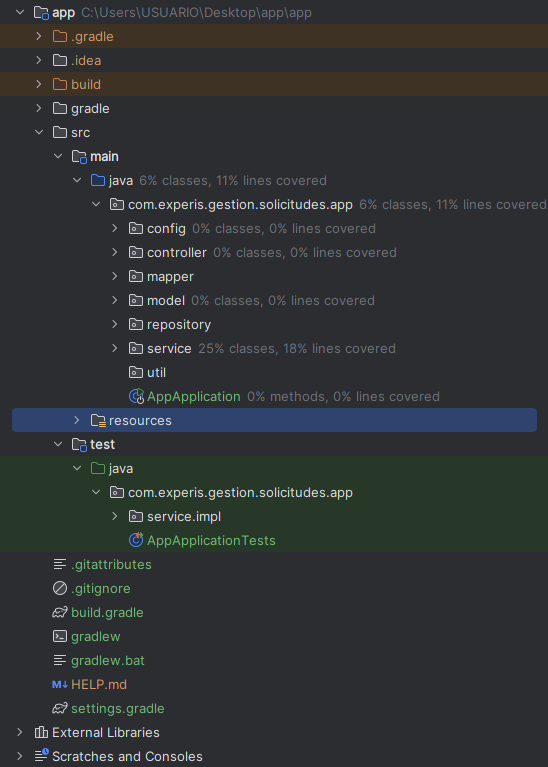

# 📚 Gestión de Solicitudes Backend

## Descripción del Proyecto

El proyecto **Gestión de Solicitudes** es un microservicio diseñado para gestionar solicitudes y contactos en una aplicación web. Incluye servicios rest para agregar, eliminar y listar solicitudes y contactos.

---

## 🛠️ Tecnologías Utilizadas

- **Lenguaje:** Java 17
- **Framework:** Spring Boot 3.4.3
- **Base de Datos:** Postgres
- **Conectividad Reactiva:** R2DBC
- **Gestor de Dependencias:** Gradle
- **Editor Recomendado:** IntelliJ IDEA

---

## Pasos para Ejecutar el Proyecto 🚀 

#### **Requisitos Previos**
- **Java JDK 17** instalado.
- **Gradle** instalado.

#### **Instrucciones**

1. **Clona el repositorio:**
   ```bash
   git clone https://github.com/AngeloQP/gestion-solicitudes-backend.git

2. **Instalar dependencias:**

   ```bash
   ./gradlew build

3. **Compila y ejecuta el backend:**

   ```bash
   ./gradlew bootRun

4. **Accede a Postgres en application.properties**

   - **Configuración de referencia:**
     - **spring.datasource.url:** `r2dbc:postgresql://localhost:5432/solicitudesdb`
     - **spring.r2dbc.username:** `postgres`
     - **spring.r2dbc.password:** `root`

5. **Acceder a la documentación Swagger:**

   - **URL:** [(http://localhost:8080/api/doc/swagger-ui/index.html](http://localhost:8081/webjars/swagger-ui/index.html#/))]


---

## 📁 Estructura del Proyecto




## 📸 Swagger


